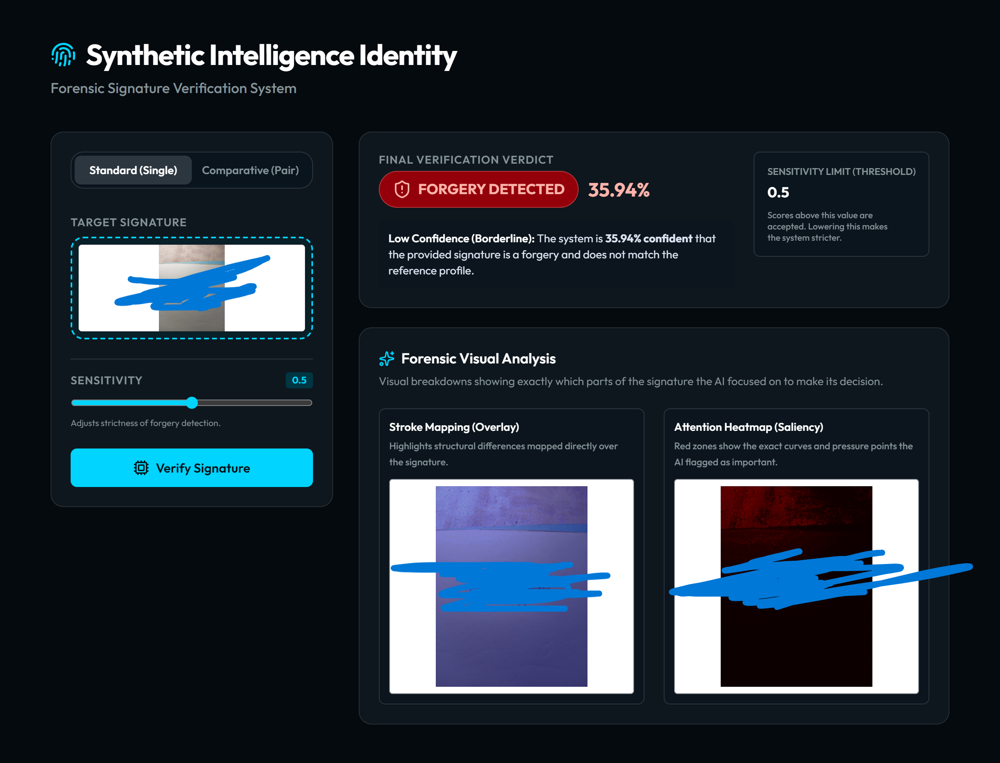

<!-- @format -->

# 🖥️ Synthetic Intelligence Identity UI

This folder contains the full-stack web application interface for the Signature Verification Pipeline. It provides a beautiful, responsive, and intuitive way to test the models directly in your browser without using the command line.

The application is split into two components:

- **`api/` (Backend)**: A FastAPI server that loads the PyTorch models and exposes verification endpoints.
- **`web/` (Frontend)**: A React application built with Vite and Tailwind CSS v4.

## 🎯 Preview



---

## 🚀 Quick Start Guide

You must run both the backend API and the frontend web server simultaneously.

### 1. Start the Backend API

The backend relies on the root project's `inference.py` and model weights.

1. Open a terminal and navigate to the `app/api` directory:
   ```bash
   cd app/api
   ```
2. Start the FastAPI server:

   ```bash
   python server.py
   ```

   _The server will load the PyTorch models into memory (which may take a few moments) and start listening on `http://0.0.0.0:8000`._

### 2. Start the Frontend Web App

1. Open a **new** terminal window and navigate to the `app/web` directory:
   ```bash
   cd app/web
   ```
2. Install the necessary Node dependencies (we use `pnpm`):
   ```bash
   pnpm install
   ```
3. Start the development server:

   ```bash
   pnpm run dev --host
   ```

   _The `--host` flag exposes the app on your local network, allowing you to test it from your mobile phone!_

### 3. Access the Interface

Open your browser and navigate to the local URL provided by Vite (usually `http://localhost:5173` or `http://localhost:5174`).

**Testing on your phone:**
If you want to test the app on your phone, you need to tell the frontend where to find the backend API on your local network.

1. Ensure your phone and computer are on the same Wi-Fi network.
2. Check the Vite terminal output for your Network IP (e.g., `http://10.105.169.231:5173`).
3. Open the `app/web/.env` file and update the `VITE_API_BASE` URL to match your computer's IP address on port 8000 (e.g., `VITE_API_BASE=http://10.105.169.231:8000`).
4. Restart your Vite development server, then visit the IP address on your phone.

---

## ✨ Features

- **Standard (Single) Mode**: Upload a single signature to test against the Baseline CNN model.
- **Comparative (Pair) Mode**: Upload a known reference signature and a questioned document to test against the Siamese Network.
- **Adjustable Sensitivity**: Tweak the decision threshold directly from the UI to see how strictness affects the verdict.
- **Forensic Visual Analysis**: View interactive Stroke Mapping and Attention Heatmaps so you can see exactly which pen strokes the AI flagged.

---

## 📁 Folder Structure & Key Files

The `app/` directory is logically separated into the backend (`api/`) and the frontend (`web/`).

### `app/api/` (Backend)

This folder houses the FastAPI backend that connects the PyTorch models to the web.

- **`server.py`**: The core API server. It loads the PyTorch models into memory on startup and handles incoming POST requests for `baseline` and `siamese` verifications. It also manages background cleanup of temporary files.
- **`test_api.py`**: A helpful utility script you can run from the command line to test the API endpoints directly without needing the React frontend.
- **`temp_uploads/`**: A temporary directory where uploaded images are saved just long enough for the models to process them. Files here are automatically cleaned up.
- **`explanations/`**: This directory acts as a static file server. The AI-generated stroke mapping and attention heatmaps are saved here so the React frontend can fetch and display them via URLs.

### `app/web/` (Frontend)

This folder contains the React application built with Vite and Tailwind CSS v4.

- **`.env`**: Holds environment variables, crucially `VITE_API_BASE`, which tells the frontend where the backend API lives (e.g., `http://localhost:8000` or a local IP).
- **`package.json` & `vite.config.js`**: Project configuration files handling dependencies (like `axios`, `lucide-react`) and Vite bundling rules.
- **`src/index.css`**: Contains all the global styling tokens, the Tailwind v4 imports, Google Font imports (Outfit, Space Mono), and the bespoke "Deep Space" color palette.
- **`src/App.jsx`**: The heart of the frontend. It manages the layout, toggles between "Standard" and "Comparative" modes using React's `<Activity>` component (to preserve form state), handles API calls, and catches errors.
- **`src/components/`**:
   - **`FileUpload.jsx`**: A reusable, interactive drag-and-drop file upload zone. It uses `URL.createObjectURL` to immediately preview the selected signature.
   - **`ResultsDisplay.jsx`**: The component responsible for beautifully rendering the final verdict. It parses the confidence score, displays the success/failure badges, and organizes the explainability heatmaps into responsive grids.
   - **`Toast.jsx`**: A floating, animated notification component that slides in from the top right to display any API or validation errors gracefully.
